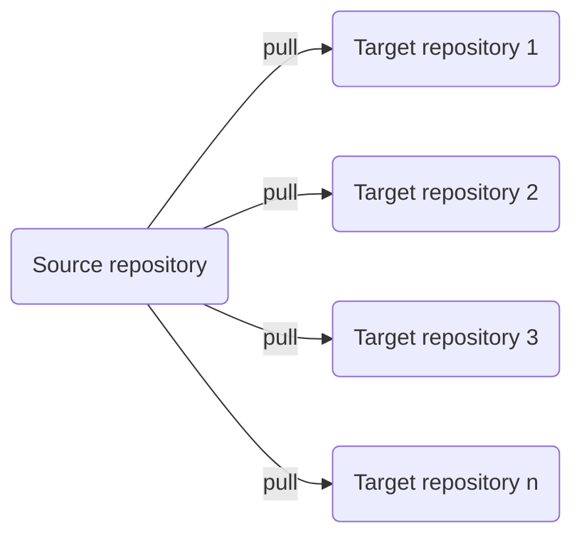

# Common GitHub Actions Workflows

This repository contains GitHub Actions workflows boilerplate that you want to run in other repositories. The benefit of this is we save time by maintaining the workflow YAMLs in only one place and they will be synced to target repositories you want.

This works by setting up the [Sync Files workflow](.github/workflows/sync.yml) in your target repositories and it will automatically sync files or folders that you want. The workflow will overwrite only files that exist in the source repositories and leave other files untouched so you can still have custom workflows or configurations in yout target repositories.

