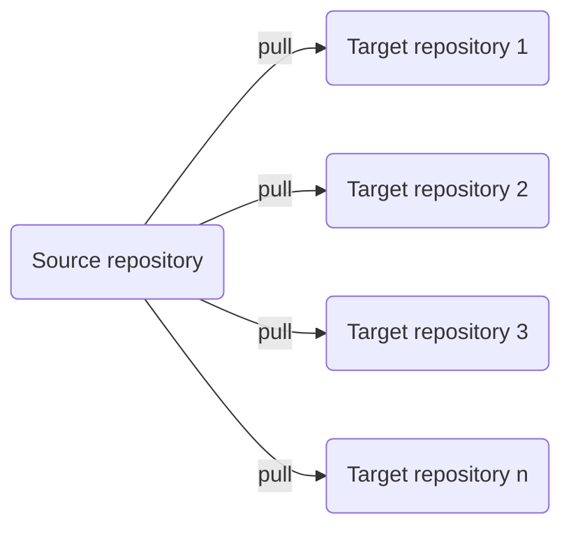

# Common GitHub Actions Workflows

This repository contains GitHub Actions workflows boilerplate that you want to sync to other repositories. This saves your time so you only make changes to common workflow YAMLs in one place without doing it in each repository one by one.

This works by creating a new GitHub Actions workflow in your target repositories and it will automatically sync files or folders from this repository. The workflow can be customized so it only overwrites or deletes specific files and folders.



This sync process is designed to work well with [GitHub Flow](https://docs.github.com/en/get-started/quickstart/github-flow).

## Usage

1. Generate a new Personal Access Token with proper permissions as follow:
  
   - For classic token, choose `repo` and `workflow`.
   - For fine-grained token, choose the following:
   
    ```properties
    Repository:Contents=Read and write
    Repository:Metadata=Read-only
    Repository:Secrets=Read and write
    Repository:Workflows=Read and write
    ```

2. Manually run the workflow [Sync Secrets](https://github.com/pacroy/gh-common-workflows/actions/workflows/_sync_secrets.yml) and input your target repository.

    

3. In your target reposotory, create a new workflow `.github/workflows/sync.yml` copy the content from [sync.yml](.github/workflows/sync.yml).

4. Get the workflow runs and it will automatically sync files and folders which you can customize in [sync.yml](.github/workflows/sync.yml)
