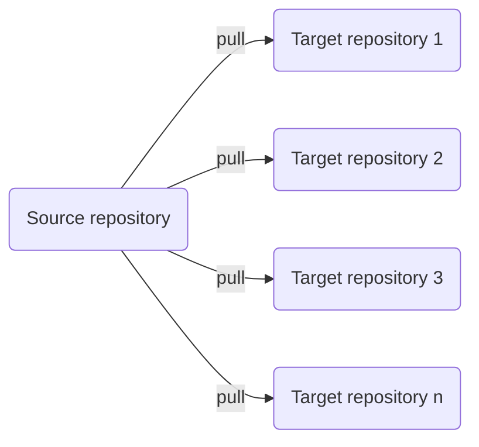

# Common GitHub Actions Workflows

[](https://github.com/pacroy/gh-common-workflows/actions/workflows/linter.yml) [](https://github.com/pacroy/gh-common-workflows/actions/workflows/mdlink.yml)

This repository is the source of truth for shared GitHub Actions workflows that are synced into other repositories. The goal is to maintain common workflow configuration in one place and propagate updates consistently.

The sync pattern is simple: target repositories keep a local copy of `.github/workflows/sync.yml`, and that workflow pulls `.github/` content from this repository.


```mermaid
  graph LR;
    source("Source repository")
    target1("Target repository 1")
    target2("Target repository 2")
    target3("Target repository 3")
    targetn("Target repository n")

    source --pull--> target1
    source --pull--> target2
    source --pull--> target3
    source --pull--> targetn
```

This sync process is designed to work well with [GitHub Flow](https://docs.github.com/en/get-started/quickstart/github-flow).

## Repository Structure

Current workflows in `.github/workflows`:

- `linter.yml` (public)
- `mdlink.yml` (public)
- `sync.yml` (sync utility)
- `_sync_secrets.yml` (admin utility)

Naming convention:

- Public workflows to distribute: no prefix (for example, `linter.yml`)
- Internal/admin workflows: underscore prefix (for example, `_sync_secrets.yml`)
- Reserved internal reusable pattern: `wf_*.yml` (excluded from sync when present)

## Sync Behavior

`sync.yml` currently syncs an explicit whitelist from source to target using `rsync`:

- `.github/workflows/sync.yml`
- `.github/workflows/mdlink.yml`
- `.github/workflows/linter.yml`
- `.github/mdlink/`

This keeps internal utility workflows and repository-specific files out of target repositories by default.

When run, the workflow:

1. Checks out the target repository to `target/`
2. Checks out source files to `source/`
3. Syncs the whitelisted files and folders
4. Publishes a job summary of changed files
5. Commits and pushes if there are changes

## Setup and Usage

1. Generate a new Personal Access Token with proper permissions as follows:

   - For classic token, choose `repo` and `workflow`.
   - For fine-grained token, choose the following:

   ```properties
   Repository:Contents=Read and write
   Repository:Metadata=Read-only
   Repository:Secrets=Read and write
   Repository:Workflows=Read and write
   ```

2. Save the token as repository secret `SYNC_PAT`.

3. In each target repository, create `.github/workflows/sync.yml` by copying [sync.yml](.github/workflows/sync.yml) from this repository.

4. Trigger the target repository sync workflow.

   - On pull requests to `main`, sync runs automatically.
   - You can also run it manually via `workflow_dispatch`.

5. (Optional) Use [Sync Secrets](https://github.com/pacroy/gh-common-workflows/actions/workflows/_sync_secrets.yml) from this repository to propagate secrets safely (supports `dry_run`).

## Notes

- If you add more files or folders to distribute, update the whitelist in `sync.yml`.

